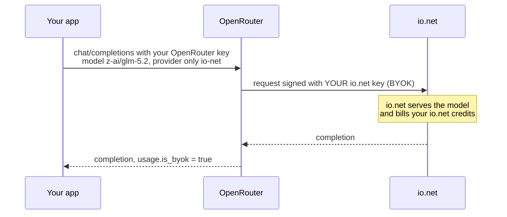

## Overview

OpenRouter's **Bring Your Own Key (BYOK)** lets you route OpenRouter requests for
io.net models through **your own io.net account**. You keep OpenRouter's unified API,
SDKs, and routing, while inference is served and billed by io.net against your io.net
credits — at io.net's direct rates instead of a resale markup.

### Why use it

- **Pay io.net's rate** on your io.net balance, not OpenRouter's resale price.
- **Low OpenRouter fee** — BYOK is **0% for your first 1,000,000 requests each month**
  (5% after), charged to your OpenRouter credits.
- **No code changes** — keep the OpenRouter SDKs and tooling you already use.
- **Pin io.net** for the latency or throughput you want, with fallback control.

## How it works



## Prerequisites

<Steps>
  <Step title="An io.net account with an API key and credits">
    Create an API key in your io.net account and make sure the account has a positive
    credit balance — this is what pays for inference. See
    [API Keys and Secrets](/guides/intelligence/api-keys-and-secrets) and
    [IO Intelligence Payments](/guides/payment/io-intelligence-payments).
  </Step>
  <Step title="An OpenRouter account with credits">
    OpenRouter still needs a small credit balance to cover its BYOK fee. Add credits at
    [openrouter.ai/settings/credits](https://openrouter.ai/settings/credits).
  </Step>
</Steps>

## Set it up

<Steps>
  <Step title="Copy your io.net API key">
    From your io.net account, create or copy an API key. Keep it handy for the next step.
  </Step>
  <Step title="Register the key in OpenRouter">
    Open OpenRouter's BYOK settings for io.net at
    [openrouter.ai/settings/integrations](https://openrouter.ai/settings/integrations)
    and select **io.net**.

    - Click **Add key** and paste your io.net API key.
    - Place it in the **Prioritized** section so OpenRouter uses it first.
    - Make sure the key's toggle is **enabled**.

    <Tip>
      Enable **"Always use for this provider"** if you want requests to fail rather
      than silently fall back to OpenRouter's shared io.net capacity.
    </Tip>
  </Step>
  <Step title="Allow the io.net provider">
    Check [openrouter.ai/settings/privacy](https://openrouter.ai/settings/privacy) and
    confirm **io.net is not in your ignored providers** list.
  </Step>
</Steps>

<Note>
  Give the new key about a minute to take effect before testing.
</Note>

## Make a request

Call OpenRouter as usual and pin the io.net provider so your BYOK key is used:

<CodeGroup>

```bash cURL
curl https://openrouter.ai/api/v1/chat/completions \
  -H "Authorization: Bearer $OPENROUTER_API_KEY" \
  -H "Content-Type: application/json" \
  -d '{
    "model": "z-ai/glm-5.2",
    "messages": [{ "role": "user", "content": "Hello!" }],
    "provider": { "only": ["io-net"], "allow_fallbacks": false },
    "usage": { "include": true }
  }'
```

```python Python (OpenAI SDK)
from openai import OpenAI

client = OpenAI(
    base_url="https://openrouter.ai/api/v1",
    api_key="<your OpenRouter API key>",
)

resp = client.chat.completions.create(
    model="z-ai/glm-5.2",
    messages=[{"role": "user", "content": "Hello!"}],
    extra_body={
        "provider": {"only": ["io-net"], "allow_fallbacks": False},
        "usage": {"include": True},
    },
)
print(resp.choices[0].message.content)
```

</CodeGroup>

<Info>
  **Available io.net models on OpenRouter:** `z-ai/glm-5.2`, `qwen/qwen3.6-27b`.
  Browse the live list on the [io.net provider page](https://openrouter.ai/provider/io-net).
</Info>

## Confirm BYOK is being used

The response `usage` block tells you whether your key served the request:

```json
"usage": { "is_byok": true, "cost": 0 }
```

`is_byok: true` means the request went through **your** io.net key. If you see
`is_byok: false`, OpenRouter served it from its shared io.net capacity instead — see
[Troubleshooting](#troubleshooting).

## Pricing

<Info>
  - **Inference** is billed by io.net to **your io.net credits**, at io.net's rates.
  - **OpenRouter** charges a **BYOK fee** from your OpenRouter credits: **0% for the
    first 1M BYOK requests per month, 5% after**.
</Info>

## Troubleshooting

<AccordionGroup>
  <Accordion title="402 Insufficient credits">
    Your OpenRouter account has no balance. BYOK still needs OpenRouter credits to
    cover its fee — add credits at
    [openrouter.ai/settings/credits](https://openrouter.ai/settings/credits).
  </Accordion>
  <Accordion title="404 No allowed providers / all providers ignored">
    io.net is in your OpenRouter **ignored providers** list. Un-ignore it at
    [openrouter.ai/settings/privacy](https://openrouter.ai/settings/privacy).
  </Accordion>
  <Accordion title="usage.is_byok is false">
    OpenRouter served the request from shared capacity instead of your key. Re-check
    that the BYOK key is **Prioritized + enabled** on the correct OpenRouter account,
    and allow ~1 minute for changes to propagate.
  </Accordion>
  <Accordion title="io.net returns 401 / 403">
    Your io.net key is invalid or the io.net account is out of credits. Recreate the
    key or top up your io.net balance.
  </Accordion>
</AccordionGroup>

## Reference

- [OpenRouter BYOK overview](https://openrouter.ai/docs/guides/overview/auth/byok)
- [OpenRouter BYOK settings](https://openrouter.ai/settings/integrations)
- [io.net provider on OpenRouter](https://openrouter.ai/provider/io-net)
